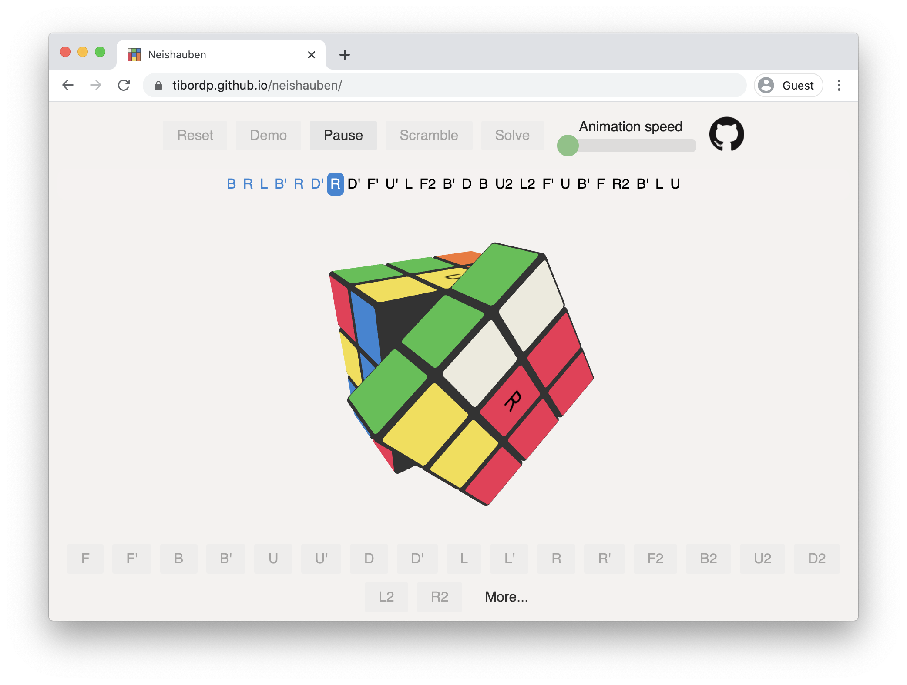

# CubeMaster Pro

CubeMaster Pro is an advanced in-browser Rubik's cube simulator with an included LBL (Layer-by-Layer) solver and professional-grade features.

## Features

- **3D Interactive Cube**: Smooth animations and realistic cube physics
- **Advanced Solver**: Intelligent solving algorithms with step-by-step guidance
- **Professional Interface**: Modern blue-themed UI with intuitive controls
- **Multiple Algorithms**: Support for various solving methods and techniques



Main functionality (operations on Rubik's Cube and the solver itself) is implemented in C (see [here](./src/runtime)) and compiled with Emscripten. The cube simulator is written in JavaScript using Three.js for stunning 3D graphics.

## Development

Build process requires Docker in order to compile C code to WebAssembly.

### Local development

Install dependencies:

```bash
yarn --silent
```

Run the development build locally

```bash
yarn wasm:dev
yarn dev
```

The app will launch at
http://localhost:8080/cubemaster-pro/

Tests run with (make sure C code is compiled first with `yarn wasm:dev` )

```bash
yarn test
```

In production build, optimization lookup tables are pre-generated during the build process and baked into the resulting WebAssembly to save on startup time (at the expense of asset size). For developing a production build:

```bash
yarn wasm:production
yarn dev
```

### Production build

```
yarn build
```
